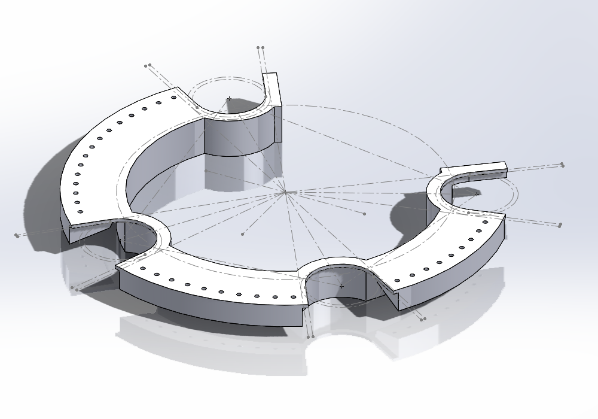
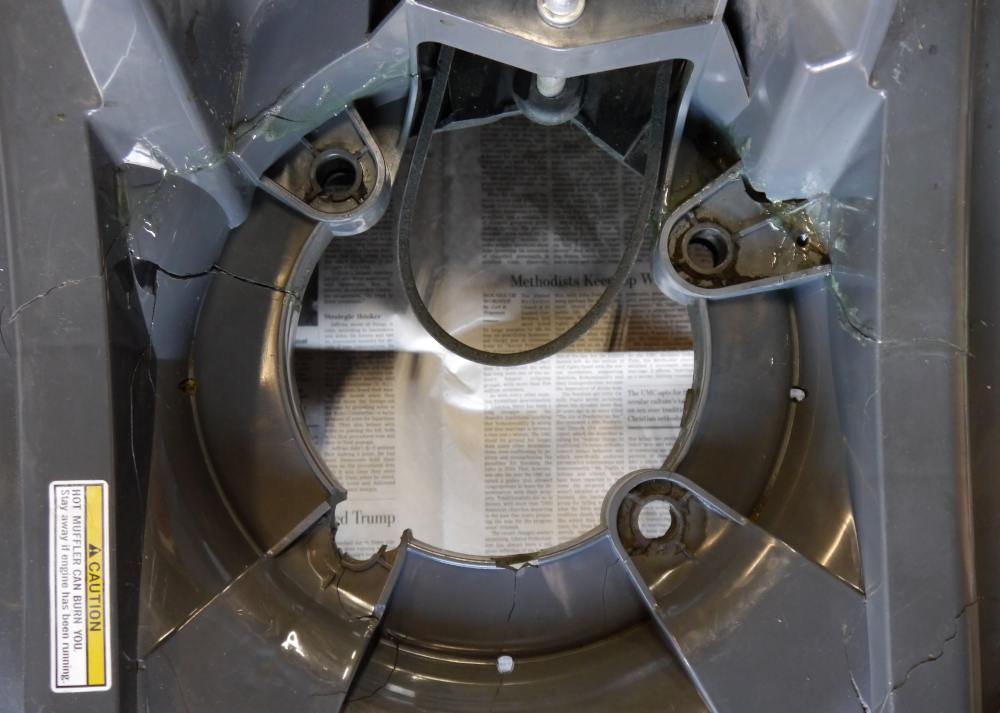

# Honda HRX217 Plastic Deck Repair

A description of my repair of a Honda HRX217VLA lawnmower with extensive cracking of the plastic deck.

Includes a downloadable 3D model of the plastic ring I designed to reinforce the damaged area of the deck.

## Description

> [!Note]
> Plenty of people have successfully built and used similar launchers.\
> Then again, there are also people who warn against using PVC pipe in compressed-air applications.\
> The Schedule 40 PVC pipe used in the air tank of this design is rated at 280 psi, and I generally charge it to 25-50 psi.\
> Review cautionary material such as the following before proceeding:  [Can PVC Pipe Be Used for Compressed Air?](https://fluidairedynamics.com/blogs/articles/can-pvc-pipe-be-used-for-compressed-air)
[disclaimer](#disclaimer)

> [!Caution]
> Plenty of people have successfully built and used similar launchers.\
> Then again, there are also people who warn against using PVC pipe in compressed-air applications.\
> The Schedule 40 PVC pipe used in the air tank of this design is rated at 280 psi, and I generally charge it to 25-50 psi.\
> Review cautionary material such as the following before proceeding:  [Can PVC Pipe Be Used for Compressed Air?](https://fluidairedynamics.com/blogs/articles/can-pvc-pipe-be-used-for-compressed-air)

## Construction

| | Qty | Desc | Source |
| :---: | :---: | --- | --- |
| 1 | 20in | 1" PVC pipe, Sch 40 | Home Depot, etc.  $2.96 |
| 2 | 2 | Reel clamp | Reel_Clamp.STL |
| 3 | 2 | PVC Male Adapter, MNPT x Socket, 1 in | Zoro G5275094 $0.67 |
| 4 | 1 | Orbit 57461 1" FPT Jar Top Automatic Sprinkler Valve | Amazon $16.48 |
| 5 | 2in | 1" PVC pipe, Sch 40 |  |
| 6 | 1 | Connector clamp | Connector_Clamp.STL |
| 7 | 1 | GASHER 1/8" NPT Tank Valve, Brass | Amazon $6.95 (pkg of 2) |
| 8 | 1 | PVC Reducing Bushing, Spigot x Socket, 2 in x 1 in Pipe Size | Zoro G5278752 $1.45 |
| 9 | 1 | PVC Coupling, Socket x Socket, 2 in | Zoro G5276433 $2.25 |
| 10 | 24in | 2" PVC pipe, Sch 40 | Home Depot, etc.  $4.94 |
| 11 | 1 | PVC Cap, Socket, 2 in Pipe Size | Zoro G5275225 $1.49 |

Assemble PVC components with the appropriate primer and cement. I used `Weld-On 15900 Twin Pack 780 PVC Regular-Bodied Plumbing Solvent Cement and Purple Plumbing Primer` (Amazon $8.34).

Use yellow Teflon tape on threaded connections. e.g. `Eastman 1/2 Inch x 260 Inch Teflon Pipe Thread for Gas Lines, 4 mil` (Amazon $2.20).

I used TE CPC connectors only because I had some on hand -- use something cheaper...

I have a 19.2V cordless drill battery pack that I pressed into service. Standard 0.25" quick-connect terminals will fit the battery's terminals. 
I added a pair of inline fuses (under the heat shrink) to prevent accidental damage... The control box contains only a momentary toggle switch for firing.

# Disclaimer
aed ef sef sff

## Projectile ("Spud")

| | Qty | Desc | Source |
| :---: | :---: | --- | --- |
| 1 | 2 | End cap | End_Cap_v3a.STL or End_Cap_v4.STL |
| 2 | 2.5in | 1/2" PVC pipe, Sch 40 | Home Depot, etc.  $1.56 / 24in |

I attached the end caps using self-tapping screws to allow experimenting with additional weight.\
I haven't found this to be necessary, though; the basic 0.7oz spud seems to work fine.

Material cost for each projectile is around $0.25, so you can afford to lose a few in the trees....

The end caps feature a loop to tie the fishing line to without any additional hardware.

## Usage

The unit as described here worked perfectly to launch a line over an approximately 55ft tall tree, using a 50 PSI charge. I haven't done any performance testing beyond that.

I loaded the reel with 15lb monofilament line (`Walmart, $2.42 for 500 yards`) and launched the line over the tree. I then pulled over some sisal (?) twine, 
and finally used the twine to pull the 3/16" Dacron antenna rope.

Additional weight could easily be added to the spuds. They're very light (0.7oz) and might benefit from some added mass, although I haven't tried this.

Many of the designers of similar projects state that modifying the valve for pneumatic triggering gives a noticeable performance improvement (see links below). 
I haven't tried this; electrical activation was easier and worked well enough for my purposes. 

One drawback of this design is that the 3d-printed end caps on the spuds can shatter if they collide hard with an obstacle. Print a couple extra!

## References

Thanks to these previous designers:

[Utah Valley ARC pneumatic launcher](https://noji.com/hamradio/pdf-ppt/noji/Noji-Article-Antenna-Launcher.pdf)

[K4ICY Antenna Launcher](http://www.k4icy.com/launcher.html)

[AE1S](http://blog.kotarak.net/2011/04/say-hello-to-my-little-friend.html)

[K8BLO](https://www.qsl.net/k8blo/launchers.html)

[WS6X](https://www.ws6x.com/squirrel.htm)

[Pneumatic Antenna Launching Systems](http://www.antennalaunchers.com/antlaunching.html)

## Contact
ac8p@proton.me

