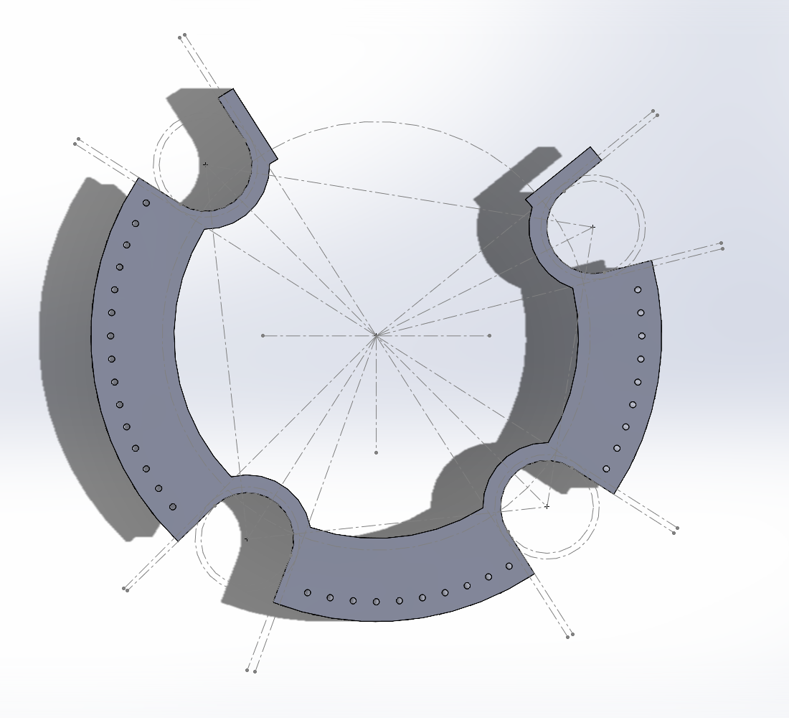
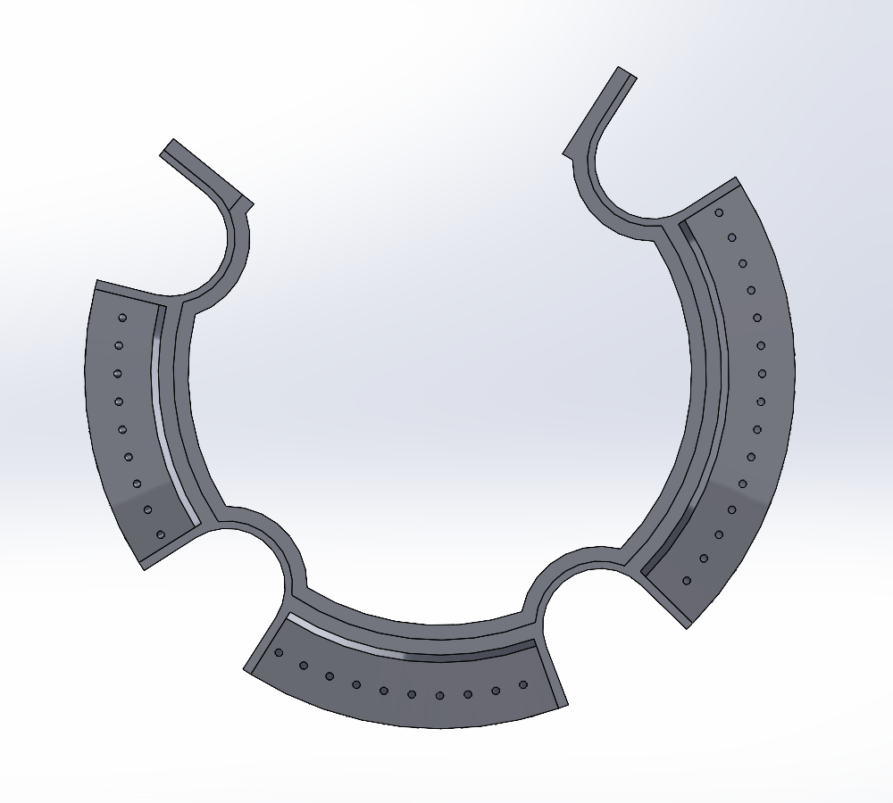
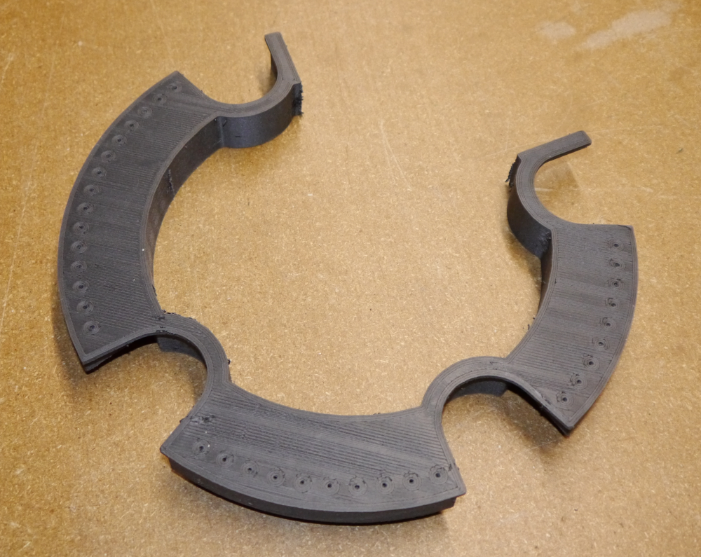
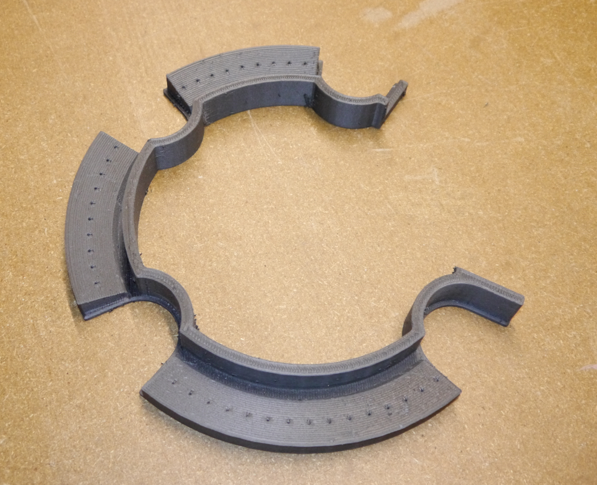
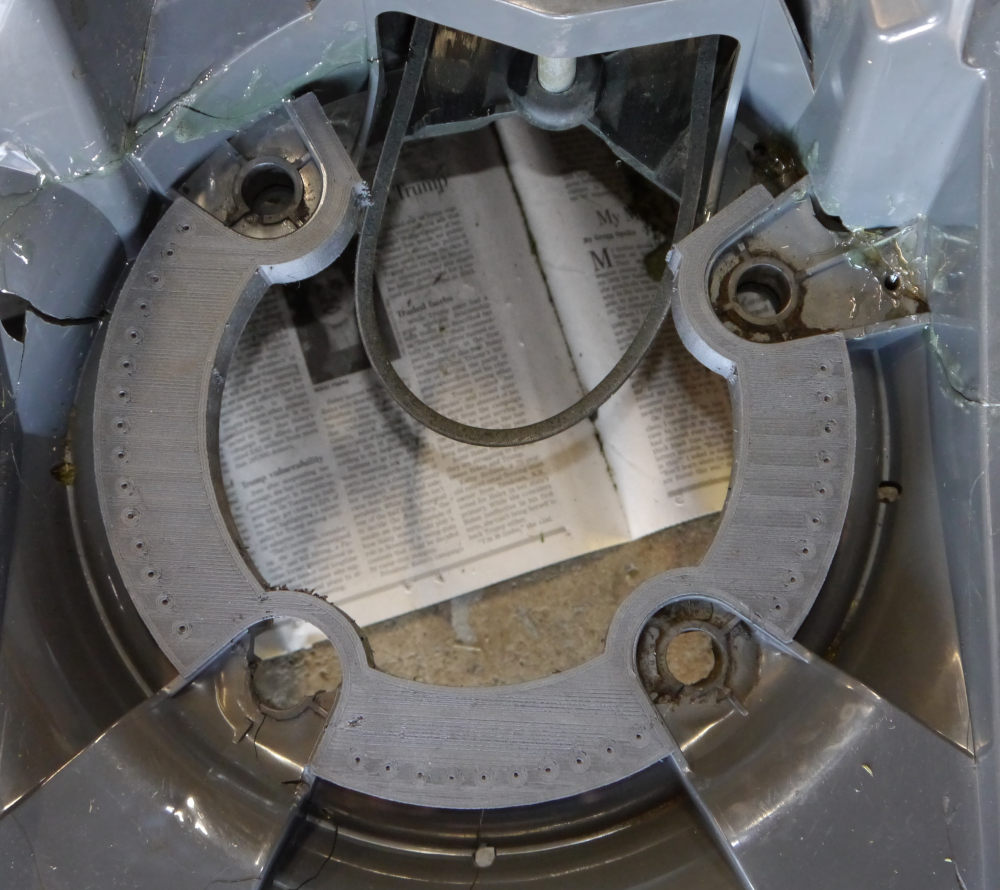
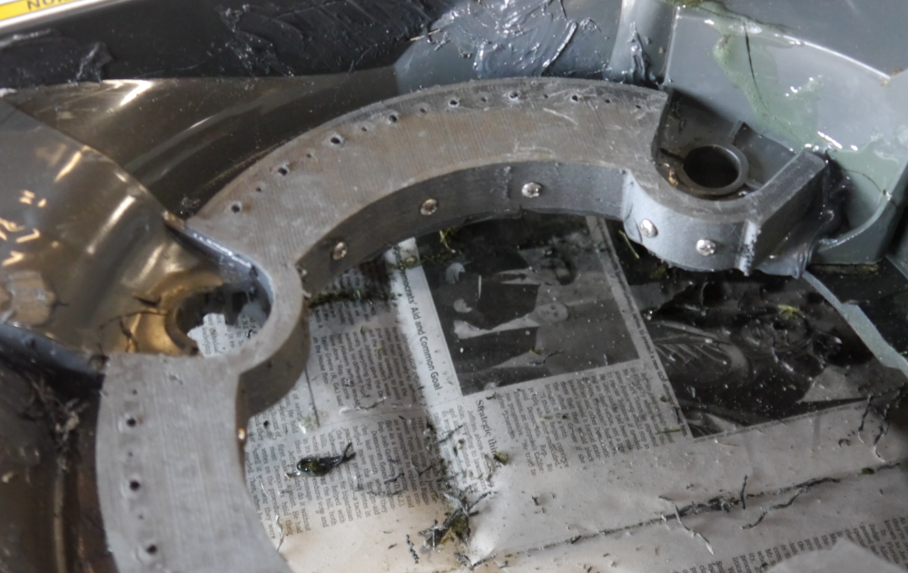
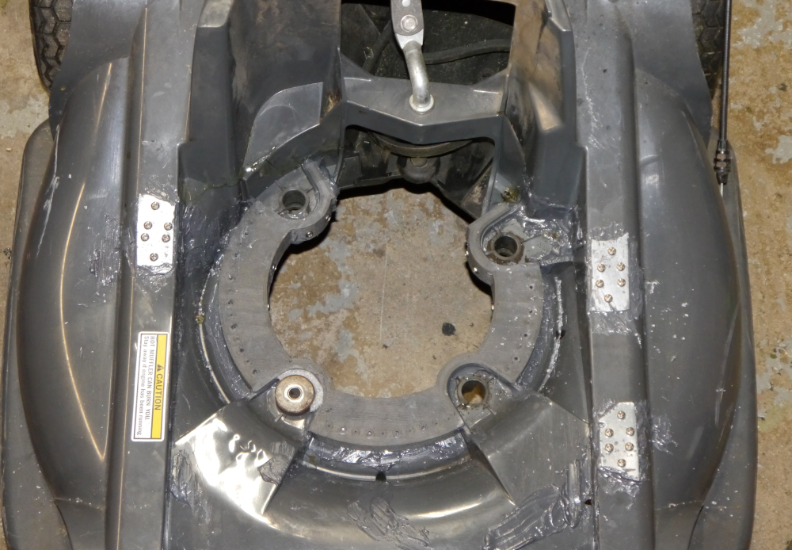

# Honda HRX217 Plastic Deck Repair

A description of my repair of a Honda HRX217VLA lawnmower with extensive cracking of the plastic deck.

Includes a downloadable 3D model of the plastic ring I designed to reinforce the damaged area of the deck.

> [!Caution]
> The procedure described here worked for me, and the 3D models are available to download for free.\
> But use the contents of this site at your own risk!\
> Review the [disclaimer](#disclaimer) at the end of this page.

## Description

As seen in this photo, the mower had extensive cracking around the central opening of the deck. 
Some of the cracks had propagated several inches across the deck. 
One of the motor mounts had mostly broken away.

My initial inclination was to try repairing the damage with epoxy (e.g. JB Weld), with steel or aluminum strips or plates as reinforcement.
That probably would have worked, although I had concerns about mechanical strength and rigidity.

Instead, I designed a plastic ring that fits exactly over the damaged region of the deck. It's printed in carbon-fiber-reinforced nylon. 
It helps minimize the amount of expensive epoxy required, and holds everything in proper alignment while the epoxy cures.

Printed with `eSun ePA-CF` filament, the cost to produce the part is around $7.50.

## Procedure

The 3D models are in the folder `models`. The file `Reinforcing Ring Final.STL` is the complete ring.  
The file `Fit Test Final.STL` is a truncated version that's much quicker to print; you can check if the part fits your mower before printing the full model.

The ring pressed into place:

I slathered on an ample amount of epoxy on both mating surfaces before pressing the ring into place.

After curing, I added a handful of sheet metal screws from both the underside and vertical edges (`#6-20 x 3/8" Phillips Drive Pan Head Grade 410 Type B Point Stainless Steel Sheet Metal Screw, Fastenal PN 0148220`)
The ring has guide holes to aid in drilling for the underside screws.

The completed repair. I added some epoxy and steel plates across the cracks that had spread the furthest, and reconstructed the area around the broken motor mount with JB Weld.

# Disclaimer
You access to and use the contents of this site at your own risk.\
The author assumes no responsibility or liability for any errors or omissions in the content of this site.\
The information and models provided on this site are provided in good faith, however we make no representation  or warranty of any kind,
express or implied, regarding the accuracy, adequacy,  validity, reliability, or completeness of any information on the site.

## Contact
ac8p@proton.me

